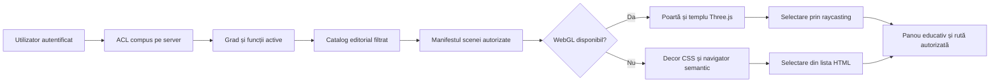

# Templul 3D — documentație funcțională și tehnică

Starea documentată: 13 iulie 2026  
Motor: Three.js `0.185.1`  
Rute: `/templu` și `/portal/templu`

## 1. Scopul experienței

Templul este interfața de orientare a portalului privat. El combină:

- o scenă WebGL 3D procedurală;
- un manifest compus pe server pentru gradul, Loja și funcțiile active;
- repere educative care deschid modulele autorizate;
- o interfață HTML semantică echivalentă pentru mobil, tastatură și lipsa WebGL.

Scena nu reprezintă un mecanism de securitate. Autorizarea este realizată pe server, iar clientul primește numai manifestul corespunzător contextului efectiv.

## 2. Ce este 3D real și ce nu este

### 2.1 Randare WebGL reală

Următoarele elemente sunt obiecte Three.js randate într-un `WebGLRenderer`:

- poarta, canaturile, stâlpii, capitelurile, lintelul și frontonul;
- ciocanul porții, inserțiile metalice, pardoseala și axul luminos de acces;
- pereții, coloanele, treptele, bolțile și inelele arhitecturale;
- pardoselile distincte pentru fiecare grad;
- reperele simbolice și funcționale;
- halourile obiectelor interactive;
- particulele ambientale;
- luminile direcționale, emisive și punctuale;
- camera în perspectivă și animațiile de deschidere, plutire și paralaxă.

### 2.2 Interfață HTML/CSS suprapusă

Nu sunt obiecte 3D:

- titlul scenei, Loja, gradul și indicatorul de administrator;
- butoanele pentru calitate și ecran complet;
- instrucțiunile celor trei bătăi;
- navigatorul semantic al reperelor;
- panoul cu întrebarea educativă și pașii de reflecție;
- butoanele și legăturile către module;
- mesajele pentru cititoarele de ecran.

Aceste elemente rămân intenționat HTML pentru accesibilitate, claritate și utilizare pe mobil.

### 2.3 Fallback fără WebGL

Când browserul nu poate crea un context `webgl2` sau `webgl`, canvasul Three.js nu este inițializat. Aplicația afișează un decor CSS/2.5D format din:

- boltă întunecată;
- lumină axială;
- contururi de coloane și arhitectură;
- pardoseală în perspectivă;
- planul templului după planșă (stratul `.csa-xp-plan`): Delta cu ochiul, Luna, Soarele, cele trei lumini și coloanele B/J;
- steaua flamboyantă, afișată numai la gradul 2;
- variație cromatică pe grad.

Fallback-ul nu este 3D real. Toate acțiunile rămân disponibile în navigatorul semantic. Browserul intern Codex folosit la verificare nu expune WebGL și afișează acest mod simplificat.

## 3. Fluxul de randare

Manifestul este obținut prin metoda Meteor `temple.experienceManifest`. Clientul îl normalizează și limitează defensiv înainte de randare.

Compoziția efectivă are două surse:

- presetul din `experience/server/scenes.js` furnizează mediul, camera, pardoseala și arhitectura;
- catalogul editorial furnizează titlul, subtitlul, motivul, simbolurile și funcțiile autorizate.

La îmbinare se păstrează din preset numai reperele funcționale de navigare cu tipurile `assembly`, `concept`, `dashboard`, `library`, `mentor` și `project`. Reperele `symbol`, `tool` și `office` din preset sunt înlocuite cu variantele filtrate și regenerate din catalog. Atmosfera declarată în catalog nu controlează încă rendererul; rendererul folosește mediul presetului.

## 4. Poarta 3D

Poarta este construită procedural în `buildGate()` și conține:

| Element | Geometrie Three.js | Comportament |
|---|---|---|
| Stâlpi laterali | `BoxGeometry` | Cadru static din piatră |
| Capiteluri | `BoxGeometry` | Cadru static |
| Lintel | `BoxGeometry` | Închidere superioară |
| Fronton triunghiular | `ConeGeometry` cu 3 segmente | Element arhitectural |
| Două canaturi | `BoxGeometry` în grupuri-balama | Se rotesc la deschidere |
| Inserții și panouri | `BoxGeometry` | Material metalic/auriu |
| Ciocan | `TorusGeometry` | Pulsează la fiecare bătaie |
| Lumină de răspuns | `PointLight` | Se aprinde temporar la bătaie |
| Sol și traseu | `PlaneGeometry` | Definește pragul și axul de intrare |
| Pulbere luminoasă | `BufferGeometry` + `Points` | Atmosferă animată |

Interacțiunea acceptă click, tap și buton accesibil. După a treia bătaie:

1. canatul stâng se rotește până la aproximativ `-1.42` radiani;
2. canatul drept se rotește până la aproximativ `+1.42` radiani;
3. camera înaintează spre prag și urcă discret;
4. după `1450 ms`, scena porții este înlocuită cu scena gradului.

Cu `prefers-reduced-motion`, lipsă WebGL sau opțiunea „Intră fără animație”, tranziția este imediată. Trecerea porții este memorată în `sessionStorage` pentru utilizator și nu se repetă în aceeași sesiune.

## 5. Componente comune ale templului

### 5.1 Motorul geometric

Manifestul poate cere următoarele geometrii:

| Tip manifest | Geometrie Three.js |
|---|---|
| `box` | `BoxGeometry` |
| `cone` | `ConeGeometry` |
| `cylinder` | `CylinderGeometry` |
| `dodecahedron` | `DodecahedronGeometry` |
| `icosahedron` | `IcosahedronGeometry` |
| `octahedron` | `OctahedronGeometry` |
| `sphere` | `SphereGeometry` |
| `star` | `ExtrudeGeometry` dintr-un `Shape` stelat (`points`, `radius`, `innerRadius`, `depth`) |
| `torus` | `TorusGeometry` |
| `torusKnot` | `TorusKnotGeometry` |

Tipul `star` acoperă Delta luminoasă (3 vârfuri, `innerRadius = radius / 2` dă un triunghi echilateral) și steaua flamboyantă (5 vârfuri). Pardoseala acceptă suplimentar tipul `lodge`: placă de piatră cu pavajul mozaicat central (`carpet` cu `width`, `depth`, `tilesX`, `tilesZ`, `z`, `colors`, `border`) și bordură dantelată.

Geometria actuală este procedurală. Nu sunt încărcate modele externe GLTF/GLB.

### 5.2 Materiale și iluminare

- arhitectura folosește `MeshStandardMaterial`;
- materialele acceptă culoare, emisivitate, rugozitate, metalicitate și opacitate;
- materialele acceptă `map: 'terrestrial' | 'celestial'` — texturi procedurale deterministe desenate pe canvas de client (nu se încarcă imagini externe), aplicate și ca `emissiveMap` pentru lizibilitate în lumină scăzută;
- scena folosește `HemisphereLight`, `DirectionalLight` și `PointLight`;
- tonemapping-ul este `ACESFilmicToneMapping` în spațiul de culoare sRGB;
- fiecare grad are culori, ceață, poziția luminii principale și cameră proprii;
- umbrele dinamice sunt dezactivate pentru performanță.

### 5.3 Obiecte interactive

Fiecare reper interactiv este un grup format din:

- corp geometric;
- material ușor emisiv;
- halo circular;
- identificator și date de interacțiune;
- poziție de bază și parametru pentru mișcarea ambientală.

Pe desktop, raycasting-ul identifică obiectul de sub cursor. La selectare, obiectul:

- își mărește intensitatea emisivă;
- accentuează haloul;
- crește la scara `1.09`;
- deschide panoul HTML cu descrierea, întrebarea și acțiunea.

Fără `prefers-reduced-motion`, reperele plutesc discret, se rotesc lent, iar camera reacționează ușor la poziția cursorului.

Reperele cu `presentation: 'list'` nu primesc corp 3D: rămân disponibile exclusiv în navigatorul semantic. Sunt marcate astfel reperele fără o reprezentare fizică fidelă planșei — planșele desenate, parcursurile, „cercurile" funcționale, „camerele" de studiu, Ramura de Acacia — și **toate markerele funcțiilor** (Conducerea Lojei, Arhiva Vie, Camera Măsurii, Vatra Fraternă, Biblioteca Vie, Legalitate și concluzii, Atelierul de instruire, Pregătirea Ținutei, Starea pragului, Cercul mentoratului, Parcursul Ucenicului/Calfei): funcțiile au deja pupitrele lor în arhitectura scenei, iar instrumentele se deschid din listă.

Panoul de detalii este non-modal: scena rămâne interactivă cât timp panoul este deschis, iar selectarea altui reper (din scenă sau din listă) înlocuiește direct conținutul. Escape închide panoul.

**Privirea liberă**: tragerea cu mouse-ul sau cu degetul (pointer events, `touch-action: none`) rotește privirea în jurul poziției camerei — yaw limitat la ±1,35 rad și pitch între −0,32 și +0,44 rad, cu amortizare. Convenția este „lumea urmează degetul". Un click/tap scurt (sub 9 px de mișcare) selectează; o tragere mai lungă doar rotește. Privirea trasă rămâne activă și cu `prefers-reduced-motion`, fiind o mișcare inițiată explicit. Nu există mers liber sau zoom.

## 6. Scena pentru grad neconfigurat

Scena de siguranță nu livrează conținut de grad. Conține:

- pardoseală plană cu grilă;
- perete posterior;
- două coloane;
- un octaedru interactiv pentru revenirea la tabloul de bord.

Rolul ei este să indice că gradul trebuie stabilit în registrul Loji.

## 7. Scenele pe grade — sala lucrărilor după „Planșa nr. 1"

Începând cu versiunea din 13 iulie 2026, cele trei grade primesc aceeași sală
a lucrărilor, construită procedural după planșele din ritualuri (Planul Lojii
Ucenicilor, Planul Lojii Calfelor, Descrierea Lojii), cu orientarea canonică:
Orient la `-Z`, Occident cu intrarea la `+Z`, Miazănoapte la `-X`, Miazăzi la `+X`.

Elementele comune, prezente la toate gradele (~121 de piese de arhitectură):

- Orientul supraînălțat pe estradă, cu trepte centrale și balustradă aurie;
- fotoliul Maestrului Venerabil cu baldachin și masa cu spada flamboyantă, ciocanul și cele trei coloane mici;
- Delta luminoasă cu ochiul atoatevăzător pe peretele de Orient, flancată de Lună (Miazănoapte) și Soare (Miazăzi);
- băncile demnitarilor și mesele în romb din Orient (Ospitalier la Miazănoapte, Trezorier la Miazăzi, conform catalogului);
- mesele Secretarului (Miazănoapte) și Oratorului (Miazăzi), sub estradă;
- altarul central cu Volumul Legii Sacre deschis, echerul și compasul;
- pavajul mozaicat central, cu laturile în raportul „Secțiunii de aur" și pătrate `5 × 8` (termeni Fibonacci, conform ritualului), bordură dantelată și planșa de trasat a gradului;
- Cei Trei Mari Stâlpi, strânși la colțurile pavajului conform ritualului — Ionic (Înțelepciunea) la S-E, Doric (Forța) la N-V, Corintic (Frumusețea) la S-V — fiecare cu capitel distinct și lumânare;
- firul cu plumb care atârnă din boltă deasupra centrului pavajului (Axis Mundi, conform ritualului);
- piatra brută (Miazănoapte) și piatra cubică cu vârf (Miazăzi), la limita Orientului;
- pupitrele celor doi Supraveghetori (Occident, respectiv Miazăzi), fiecare cu coloana mică, și pupitrul Maestrului de Ceremonii lângă Primul Supraveghetor;
- coloanele Boaz (Miazănoapte) și Jachin (Miazăzi) la Occident, cu vestibulul în unghi al intrării; capitelurile diferă pe grad: la Ucenic câte trei rodii întredeschise, de la Calfă Sfera Terestră pe Boaz și Sfera Celestă pe Jachin, cu texturi procedurale (continente/graticulă, respectiv stele și constelații) desenate pe canvas și aplicate ca `map` + `emissiveMap`;
- funia cu noduri (lacs d'amour) în partea de sus a pereților, cu ciucurii coborâți de o parte și de alta a intrării;
- bolta cerească: tavan albastru-adânc cu stele fixe, sub care plutesc particulele;
- rândurile de scaune ale Fraților pe Miazănoapte și Miazăzi.

### Scena Gradului 1 — Loja Ucenicilor

- planșa de trasat cu accent rece și emblema pietrei brute;
- atmosferă rece, lumina cheie dinspre Orient-Miazănoapte;
- cameră joasă, pe axul intrării, la înălțimea privirii.

### Repere simbolice publicate

- Piatra Brută;
- Firul cu plumb;
- Pavajul Mozaicat;
- Cei Trei Mari Stâlpi;
- Coloanele Pragului;
- Cele Trei Mari Lumini;
- Bolta Înstelată.

Formele sunt reprezentări geometrice abstracte determinate de tipul interacțiunii: dodecaedru/cub, con cu patru laturi, sferă/icosaedru, tor sau poliedru. Ele nu sunt încă modele artistice fidele ale obiectelor.

### Navigare funcțională

- Camera studiului introductiv → Biblioteca;
- Cercul lucrării → Convocatoare.

Parcursul educativ este: observă → reflectează → așază în jurnal → dezbate pe grad → aplică prin faptă.

## 8. Scena Gradului 2 — Loja Calfelor

Aceeași sală, cu diferențele planșei gradului al doilea:

- steaua flamboyantă cu inima luminoasă, aprinsă la Orient deasupra treptelor (numai la acest grad);
- planșa de trasat cu accent auriu și emblema stelei;
- atmosferă mai caldă, particule aurii;
- cameră oblică dinspre Miazănoapte-Occident.

### Repere simbolice publicate

- Piatra Cubică;
- Nivela;
- Steaua Înflăcărată;
- Sferele Cunoașterii;
- Cele Cinci Ferestre;
- Marile Lumini — configurația gradului;
- Planșa Calfei.

### Navigare funcțională

- Bolta ideilor → Graful conceptelor;
- Atelierul de studiu → Biblioteca;
- Cercul participării → Convocatoare.

Parcursul educativ este: observă atent → măsoară → leagă idei → dezbate → construiește.

## 9. Scena Gradului 3 — Camera de Mijloc

Aceeași sală, cu diferențele planșei gradului al treilea:

- fără steaua flamboyantă, conform planșei;
- planșa de trasat cu emblema ramurii de acacia;
- atmosferă solemnă, întunecată, cu boltă stelară mai densă și lumina Orientului mai puternică;
- cameră ridicată deasupra vestibulului, pentru vederea ansamblului.

### Repere simbolice publicate

- Ramura de Acacia;
- Centrul Cercului;
- Marile Lumini — configurația gradului;
- Pragul Memoriei;
- Planșa Maestrului;
- Liniile Călătoriei.

### Navigare funcțională

- Cercul mentoratului → Biblioteca;
- Masa proiectelor → Biblioteca/proiecte;
- Cercul lucrării comune → Convocatoare.

Parcursul educativ este: sintetizează → asumă → însoțește → construiește împreună → păstrează și transmite.

## 10. Funcțiile și reperele administrative

Reperele funcțiilor sunt adăugate numai pentru funcțiile active și autorizate. Catalogul curent definește:

- Maestru Venerabil;
- Primul Supraveghetor;
- Al Doilea Supraveghetor;
- Orator;
- Secretar;
- Trezorier;
- Ospitalier;
- Expert;
- Maestru de Ceremonii;
- Acoperitor;
- Bibliotecar;
- Mentor.

Reperele funcțiilor sunt publicate cu `presentation: 'list'`: apar exclusiv în navigatorul semantic, fără corp 3D plutitor. Reprezentarea fizică a funcțiilor în scenă este dată de pupitrele și jilțurile din arhitectură (tronul Venerabilului, pupitrele Supraveghetorilor, mesele Secretarului/Oratorului, romburile Ospitalierului și Trezorierului, pupitrul Maestrului de Ceremonii).

Exemple de destinații:

| Funcție | Reper | Modul |
|---|---|---|
| Secretar | Arhiva Vie | Dosare Frați și registru matricol |
| Trezorier | Camera Măsurii | Metale |
| Ospitalier | Vatra Fraternă | Ospitalier |
| Bibliotecar | Biblioteca Vie | Bibliotecă |
| Mentor | Cercul mentoratului | Concepte și studiu |

Gradul 3 nu acordă automat aceste repere. Este necesar un mandat sau o delegare activă; administratorul platformei primește contextul complet, auditat.

## 11. Separarea pe grade și securitatea

Compoziția manifestului respectă următorul flux:

1. `requireCompositeAccess()` validează utilizatorul, tenantul și apartenența;
2. gradul efectiv este calculat pe server;
3. funcțiile sunt verificate prin mandate/delegări active și grad minim;
4. catalogul editorial este filtrat pentru gradul efectiv;
5. simbolurile opționale neaprobate rămân excluse;
6. serverul returnează o singură scenă, nu toate scenele;
7. clientul normalizează tipurile, culorile, rutele, limitele și numărul obiectelor.

Modificarea apartenenței, gradului, funcției, delegării, rolului sau stării tenantului emite un semnal reactiv și determină reevaluarea accesului.

### Selectorul de grad

Metoda `temple.experienceManifest` acceptă opțional `{ viewGrade }`. Serverul limitează strict: `viewGrade ≤ gradul efectiv` (administratorul platformei poate inspecta toate cele trei scene). Ucenicul nu are selector (un singur grad accesibil), Calfa poate deschide scenele 1–2, Maestrul 1–3. Catalogul editorial și presetul se compun pentru `viewGrade`, deci un grad inferior vizualizat rămâne exact scena acelui grad; markerele funcțiilor apar numai în scena gradului propriu. Manifestul expune `access.viewGrade`, `access.viewGradeLabel` și `access.maxGrade`, iar clientul afișează selectorul în bara de instrumente când `maxGrade > 1`.

## 12. Calitate și performanță

| Nivel | DPR maxim | Particule | FPS țintă desktop |
|---|---:|---:|---:|
| `low` | 1.0 | 34% | 30 |
| `balanced` | 1.35 | 68% | 45 |
| `high` | 1.8 | 100% | 60 |

Pe mobil:

- nivelul implicit este `low`;
- DPR este limitat la `1.25`;
- rata este limitată la 30 FPS;
- paralaxa este redusă;
- numărul de particule este limitat la maximum 50% din scena definită, indiferent de nivelul ales;
- FOV-ul crește la ecrane sub 560 px;
- navigatorul devine panou mobil;
- interacțiunea nu depinde de hover.

Randarea este suspendată când pagina nu este vizibilă. La distrugerea template-ului sunt eliberate geometriile, materialele, texturile, evenimentele și contextul WebGL.

## 13. Compatibilitate

Pentru scena completă este necesar:

- WebGL 1 sau WebGL 2;
- accelerare hardware disponibilă;
- JavaScript modules/dynamic import;
- un browser modern Chrome, Edge, Firefox sau Safari.

Testul de disponibilitate solicită contextul cu `failIfMajorPerformanceCaveat: true`. Un browser care poate crea doar un context software foarte lent este trecut intenționat în fallback.

## 14. Limitările versiunii actuale

Versiunea curentă este un motor 3D procedural funcțional, nu încă reprezentarea artistică finală. Nu sunt implementate încă:

- modele GLTF/GLB detaliate;
- texturi PBR de piatră, lemn, metal și țesătură;
- bijuteriile distincte ale fiecărei funcții (mobilierul planșei — tron, pupitre, mese, altar, coloane, pietre — este acum construit procedural);
- planșe ilustrate ca asseturi 3D sau texturi revizuite (planșa de trasat are doar accent cromatic și emblemă pe grad);
- litere modelate pe coloanele B/J și în steaua flamboyantă (sunt marcate prin plăci și nucleu emisiv);
- boltă stelară astronomică ori constelații configurabile;
- iluminare cu umbre dinamice sau lightmaps;
- navigare liberă de tip joc;
- personaje ori reconstituiri ceremoniale;
- sunet ambiental;
- persistarea progresului educativ în scenă.

Motorul nu adaptează automat nivelul de calitate după măsurarea FPS-ului în timpul sesiunii și nu tratează separat pierderea ulterioară a contextului WebGL. Antialiasing-ul este stabilit la inițializarea rendererului, deci schimbarea nivelului de calitate ulterior nu îl poate porni sau opri fără reconstruirea rendererului.

Conținutul restricționat din documentele-sursă nu trebuie introdus în bundle-ul client. Orice model, explicație sau compoziție nouă trece prin catalogul editorial și validarea de acces.

## 15. Direcția recomandată pentru etapa artistică

Evoluția poate păstra motorul și contractul de securitate actual, înlocuind treptat formele abstracte:

1. realizarea unui kit modular GLTF: pardoseli, coloane, bolți, trepte, porți și mobilier;
2. variante de scenă pe grade construite din același kit, cu asseturi distincte doar unde accesul o cere;
3. modele separate pentru repere, fără texte sensibile în fișierele grafice;
4. baking pentru lumină și umbre, în locul umbrelor dinamice costisitoare;
5. compresie Draco/Meshopt și texturi KTX2;
6. niveluri de detaliu și asseturi simplificate pentru mobil;
7. validare editorială și funcțională înainte de activarea fiecărui reper;
8. păstrarea navigatorului HTML ca alternativă completă.

## 16. Harta fișierelor

| Fișier | Responsabilitate |
|---|---|
| `client/engine.js` | Motor WebGL, poartă, geometrii, lumini, cameră, raycasting, animații și cleanup |
| `client/index.js` | Starea Blaze, trei bătăi, încărcare dinamică, fallback, calitate și evenimente |
| `client/index.html` | Interfața semantică, navigatorul, panoul educativ și controalele |
| `client/experience.css` | Layout responsive, overlay și fallback CSS/2.5D |
| `client/manifest.js` | Normalizarea defensivă a manifestului |
| `server/scenes.js` | Arhitectura procedurală și presetul vizual pe grade |
| `server/index.js` | ACL, funcții active, catalog editorial și manifest Meteor |
| `../temple/catalog/scenes.js` | Scenele editoriale pe grade |
| `../temple/catalog/symbols.js` | Simbolurile și obiectivele educative |
| `../temple/catalog/officers.js` | Pozițiile, responsabilitățile și modulele funcțiilor |
| `../temple/catalog/learning.js` | Parcursurile educative pe grade |
| `../temple/catalog/editorial.js` | Lista explicită a reperelor aprobate pentru publicare |

## 17. Criterii de verificare

O versiune a templului poate fi considerată validă când:

- utilizatorul anonim nu primește bundle-ul privat;
- fiecare utilizator primește numai scena gradului efectiv;
- funcțiile inactive sau expirate nu apar;
- trecerea porții funcționează cu mouse, touch și tastatură;
- scena WebGL funcționează într-un browser cu accelerare hardware;
- fallback-ul rămâne complet utilizabil fără WebGL;
- toate reperele 3D au echivalent în navigatorul semantic;
- `prefers-reduced-motion` elimină animațiile neesențiale;
- layout-ul nu produce overflow la 360, 390 și 768 px;
- schimbarea accesului reîncarcă sau retrage manifestul;
- niciun asset public nu conține texte ori elemente rezervate altui grad.
